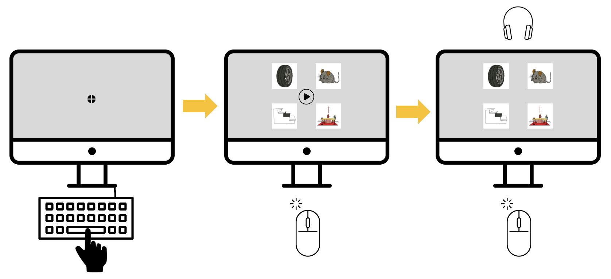

# Walkthrough: Building EyeLink-Compatible PsychoPy Experiments with VWP

## **Overview**

- The example PsychoPy experiment and all dependent files for this walk-through can be downloaded from [this link](https://github.com/CMU-Pitt-BRIDGE/psychopy-eyelink-vwp).

- I recommend examining/editing them on a computer connected to an EyeLink system. You will need to install PsychoPy, and it is recommended you use the same version that the example was built in: 2023.2.3.
- Once downloaded, you should:

  - Open the file **example_eyetracker.py** with the app **PsychoPy-2023.2.3 Coder.**
    - Note: The other file, named **EyeLinkCoreGraphicsPsychoPy.py**, should not be edited and must remain in the folder
  - Before running, be sure to load the PyLink package by opening the **Python (command line)** app and submitting the command

  ```python
  import pylink
  ```

- Note that this experiment is a bit of a “Frankenstein”: It combines aspects of PsychoPy experiments with Python coding. If you are familiar with PsychoPy Coder, you will see familiar syntax within the function defined on line 515 called `run_trial`.
  - Functions like `show_msg`, `run_trial`, etc. are defined in **Step 5** and then called toward the end of the script in **Step 7**. This allows the user complete control over the randomization of stimuli presentation and control over the presentation of instructions and breaks between trials.
  - Suppose you need a dramatically different procedure than the present task and are less comfortable writing in Python/PsychoPy. In that case, I recommend building the task you need with **PsychoPy Builder** (sans eye-tracking) and then converting it to **Coder View**. With careful adaptation, you should be able to paste that experiment code into the `run_trial` function and (hopefully!) successfully change the experiment’s procedures.

## List of crucial code chunks and their line numbers

- **Line 3:** Load packages
- **Line 19:** Standard PsychoPy Prep
- **Line 43:** EyeLink Files Set-up: EDF Filename, Local Data Folder, Counterbalances, Etc.
- **Line 133:** Beginning of “Steps” (for “talking” to EyeLink computer and running experiment)
- **Line 136:** Step 1: Connect to the EyeLink Host PC
- **Line 152:** Step 2: Open an EDF data file on the Host PC
- **Line 173:** Step 3: Configure the tracker
- **Line 219:** Step 4: Set up a graphics environment for calibration
- **Line 292:** Experiment-Specific Settings and Variables
- **Line 329:** Step 5: Defining Key Functions
- **Line 512:** Function Containing Trial Procedure
- **Line 522:** Unpacking All Trial Parameters
- **Line 639:** Start Recording
- **Line 669:** Show VWP and Wait for Click on Play Button Image
- **Line 871:** Play Target Audio and Wait for Click
- **Line 1108:** Send Messages to EDF data file
- **Line 1134:** Present Fixation Cross (and wait for spacebar)
- **Line 1150:** Step 6: Set up the camera and calibrate the tracker
- **Line 1169:** Step 7: Randomize and Run Experimental Trials
- **Line 1219:** Step 8: Disconnect, download the EDF file, then terminate task

## **Overview of Procedures in Example VWP Experiment**

- This example eye-tracking experiment is made for collecting gaze data during word recognition with a Visual World Paradigm (VWP). The experiment procedure is relatively simple (**Figure 1**):
  - Each trial begins with a **drift correction** screen. This allows us to determine the center point of the screen for analyses. Participants have to look to center and press the spacebar to continue.
  - Next the VWP images are shown with a “play button” in the center of the screen. There is no time limit. Participants can explore the images and click play when they are ready to hear the trial’s stimulus.
  - As soon as there is a click on the play button:
    - The trial target audio (a single word) is played over the headphones
    - Participants can click anywhere on the screen to end the trial (though we expect them to click on one of the four images)
      - This can be adjusted to have hard limits on where an “acceptable” click can be. The images are set with pixel locations, and mouse clicks record pixel locations, so fairly high precision is possible.
- (Not pictured: Between each trial there is a screen telling the participant to press spacebar to continue.)



**Figure 1.** Visualization of the trial procedure for the example VWP experiment. Participants fixate at the center of the screen and press spacebar to begin (gaze correction, left panel), then they are shown the VWP array and a play button (center panel), and, after clicking on the play button, the play button disappears and they click on one of the four VWP images (right panel).

---

### **Removing/Editing Counterbalances**

- If you wish to remove the counterbalancing feature altogether, you will need to comment-out lines: 62, 69-70, 83, 1123

  - Line 1174 will also need edited. If you have only one Excel sheet with the stimuli list and attributes it should read like so:

    ```python
    trial_list = pd.read_csv(“Filename.csv”)
    ```

- If you want to change the instructions for naming the counterbalances, edit the text string on lines 69-70
  - For example, if you have four counterbalances, you will want to change the instruction to [value 1, 2, 3, or 4]
- You can choose to name your CSV files however you wish so long as you edit line 1174 accordingly. For example, if you have files named **ListeningExperiment_CB1.csv** and **ListeningExperiment_CB2.csv**, you should edit line 1174 to be:

  ```python
  trial_list = pd.read_csv(“ListeningExperiment_CB” + str(counterbalance) + “.csv”)
  ```

### **Adding Dialogue Box Prompts**

- If you need an additional field, such as session number, you can add it to this prompt by following the syntax for the EDF filename and counterbalance number. Example:

```python
dlg_prompt3 = ‘Please enter the session number \n’ + \‘[value 1 or 2].’
dlg.addText(dlg_prompt3)
dlg.addField(‘Session:’, session)
session = dlg.data[2]
```

### **Customizing Experiment Randomization, Breaks, Etc.**

- You can fully customize the randomization of trials and administration of breaks in the **Step 7**
  - In the example experiment, there are 2 practice trials and 12 experiment trials
  - Midway through the experiment (i.e., after experimental trial 5), there is a break
- The example experiment randomizes the order of trials. Note that the list of items for the practice trials is _not_ randomized (but you can change this, if desired).
- For every row in your CSV file, you should have one trial. The code will index an entire row of the CSV file using the `run_trial` function. The indices in values1, values2, and values3 tell the subsequent **for loops** which (and how many) rows of the CSV file to run. Thus:
  - Because there are only two practice trials, the values1 index is 0 to 2
  - Because we want half the trials of the main task to be presented in the first block, the values2 index is 0 to 6
  - Because we want to second half of trials of the main task to be presented in the second block, the values3 index is 6 to 12
- In between these chunks of the task, we use the `show_msg` function to present instructions onscreen. The `wait_for_keypress` feature is set to `True` so that the screen stays on the current message until a keyboard response is made to continue the experiment.

### **Messages for Within-Trial Timestamps**

- One of the most critical components of the experiment are the “messages” – these are timestamps that allow us to align data across trials at stimulus onset. In the example, these messages are sent with the following code:
  - Line 660: el_tracker.sendMessage('VWP_onset')
  - Line 879: el_tracker.sendMessage('audio_onset')
  - Line 1128: el_tracker.sendMessage('!V TRIAL END')

### **Messages for Trial-Specific Information Logging**

- In order to interpret our data, we will need to save information about each trial to our EyeLink EDF file. The columns of your CSV file are fully customizable, but to ensure that the information you put in that file are saved, you will need to edit the following sections:
  - We “unpack” information from each column of an entire row of the CSV file (corresponding to one trial). In the example, you will see that we name a set of variables by indexing into trial_pars
    - Be careful when editing this section to correctly order these indices!
    - Note that in the example experiment, we only use `trial_audio` within the experiment (for selecting the soundfile to play for the present trial). If you have other stimuli that change trial-to-trial, you would want to create a column similar to `trial_audio` and index it here.
  - Next you will want to send messages with all of the current trial’s info.

## **Additional Notes**

- This example experiment organizes several dependent files into folders (named **audio**, **images**, **results**, and **spreadsheets**)
- Be sure to copy over files needed for the EyeLink procedures. This includes:
  - Audio files named `error.wav`, `qbeep.wav`, `type.wav`
  - Image named `fixTarget.bmp`
- Customize the spreadsheet files for your experiment (see section above **Customizing Experiment Randomization, Breaks, Etc.**)
- The key data file will generate in **results**
  - The .EDF file for each subject will need to be converted to .ASC if you plan to use R for pre-processing.
  - The messages in the sample experiment ensure that all important behavioral data is also included in the .EDF file (e.g., which image was clicked on)
- If you adapt your experiment to have more behavioral response elements, the output files are generated in **data** (in the current task, these behavioral data are redundant with information saved to the .EDF file).
